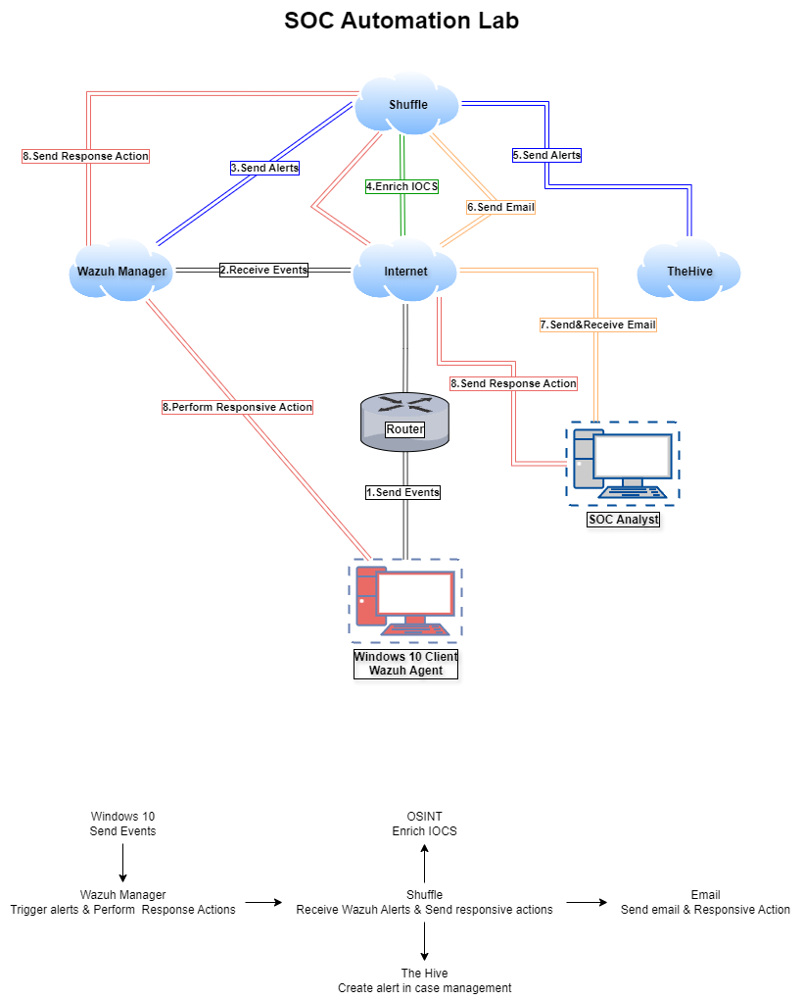

# SOC Automation Lab

## 1. Introduction

### 1.1 Overview

The SOC Automation Project aims to create an automated Security Operations Center (SOC) workflow that streamlines event monitoring, alerting, and incident response. By leveraging powerful open-source tools such as Wazuh, Shuffle, and TheHive, this project enhances the efficiency and effectiveness of SOC operations. The project involves setting up a Windows 10 client with Sysmon for detailed event generation, Wazuh for comprehensive event management and alerting, Shuffle for workflow automation, and TheHive for case management and coordinated response actions.



### 1.2 Purpose and Goals

- Automate Event Collection and Analysis: Ensure security events are collected and analyzed in real-time with minimal manual intervention, enabling proactive threat detection and response.
- Streamline Alerting Process: Automate the process of generating and forwarding alerts to relevant systems and personnel, reducing response times and minimizing the risk of overlooking critical incidents.
- Enhance Incident Response Capabilities: Automate responsive actions to security incidents, improving reaction time, consistency, and effectiveness in mitigating threats.
- Improve SOC Efficiency: Reduce the workload on SOC analysts by automating routine tasks, allowing them to focus on high-priority issues and strategic initiatives.

## 2. Prerequisites

### 2.1 Hardware Requirements

- A host machine capable of running multiple virtual machines simultaneously.
- Sufficient CPU, RAM, and disk space to support the VMs and their expected workloads.

### 2.2 Software Requirements

- VMware Workstation/Fusion or another virtualization platform.
- Windows 10 client with Sysmon installed.
- Ubuntu 22.04 for running:
  - Wazuh
  - TheHive
  - Shuffle (SOAR Platform)

### 2.3 Tools and Platforms

- **Wazuh** – Log collection, analysis, and alerting
- **Shuffle** – Automated workflows for alert handling
- **TheHive** – Incident Response and case management
- **VirusTotal** – Threat intelligence enrichment
- **Elasticsearch + Kibana** – Data storage and dashboarding

### 2.4 Prior Knowledge

- Basic virtualization skills (VMs, networking)
- Linux command-line proficiency
- Understanding of SIEM, SOAR, and log analysis

## 3. Setup

### 3.1 Step 1: Install and Configure Windows 10 with Sysmon

1. Install Windows 10 on a VM.
2. Install Sysmon and apply a detailed config file.
3. Verify Sysmon logs appear in Windows Event Viewer.

*(Insert your **own screenshots** here, replacing the original images)*

### 3.2 Step 2: Set Up Wazuh Server

1. Deploy Ubuntu VM and install Wazuh manager.
2. Configure firewall and agent registration.
3. Validate agent-to-manager connectivity.

*(Replace with **your Wazuh screenshots**)*

### 3.3 Step 3: Set Up Shuffle

1. Deploy Shuffle on Ubuntu or cloud.
2. Create workflows to handle alerts from Wazuh.
3. Set up webhook connection and test triggers.

*(Include your Shuffle UI screenshots)*

### 3.4 Step 4: Set Up TheHive

1. Install TheHive and connect it to Elasticsearch.
2. Create organizations, users, and test cases.
3. Integrate with Shuffle workflows to auto-create cases.

*(Overlay your TheHive screenshots)*

### 3.5 Step 5: Build and Test Workflow

1. Generate a Windows Sysmon event (e.g., using Mimikatz).
2. Wazuh detects the alert.
3. Shuffle parses and enriches the alert (VirusTotal, SHA256).
4. TheHive creates a new incident case.
5. (Optional) Send email or Slack notifications via Shuffle.

*(Embed your end-to-end workflow screenshots)*

## 4. Conclusion

You now have a fully automated SOC workflow leveraging open-source tools. It demonstrates:
- Real-time detection (Wazuh)
- Alert parsing and enrichment (Shuffle)
- Incident management (TheHive)

Use this foundation to:
- Enhance detection rules
- Add playbooks
- Integrate additional threat intelligence
- Map to MITRE ATT&CK

## 5. References

- [DFIR YouTube tutorials]  
- [MyDFIR articles]

## License

MIT

---

*(End of original README)** :contentReference[oaicite:1]{index=1}

---

### ✅ What You Should Do Next:

1. **Copy the entire content above** into your new `README.md`.
2. Replace the **title**, e.g.:
   ```markdown
   # SOC Automation Lab – Likith Sai
